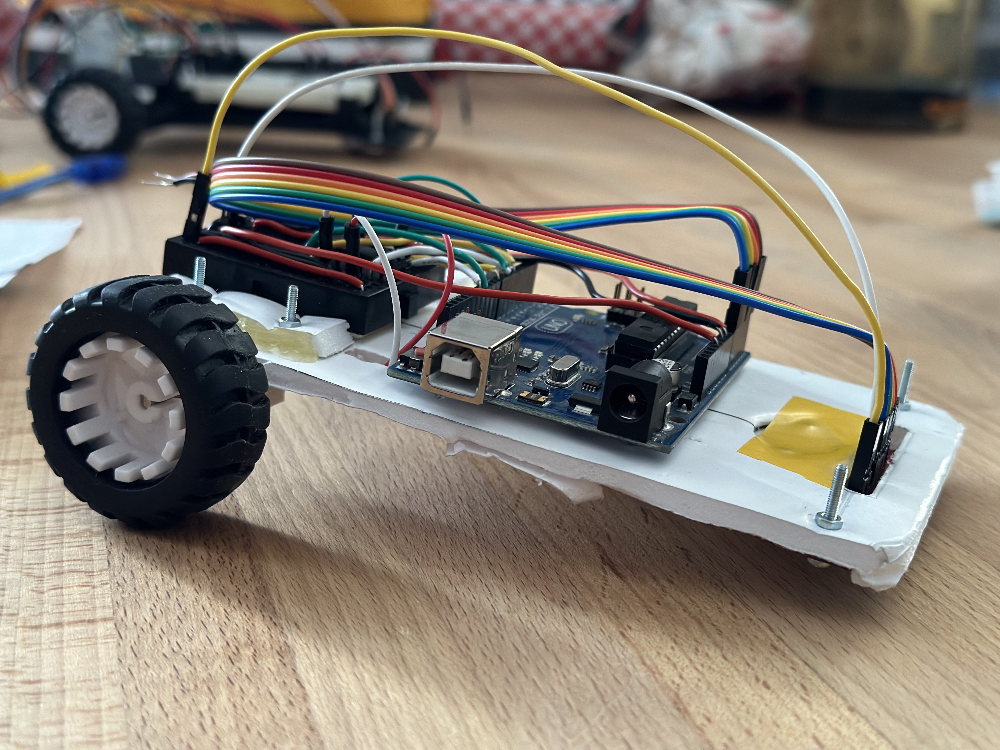
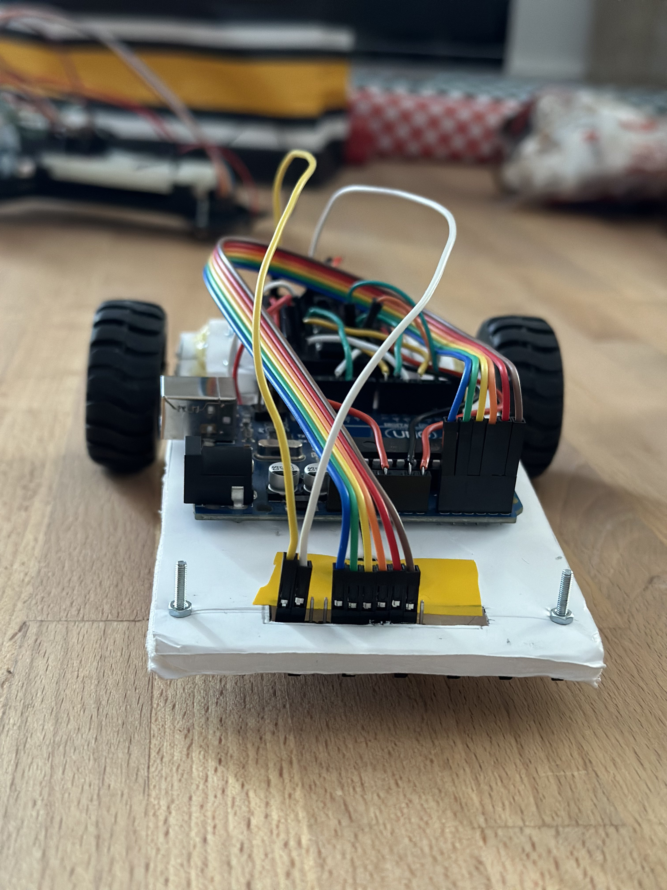
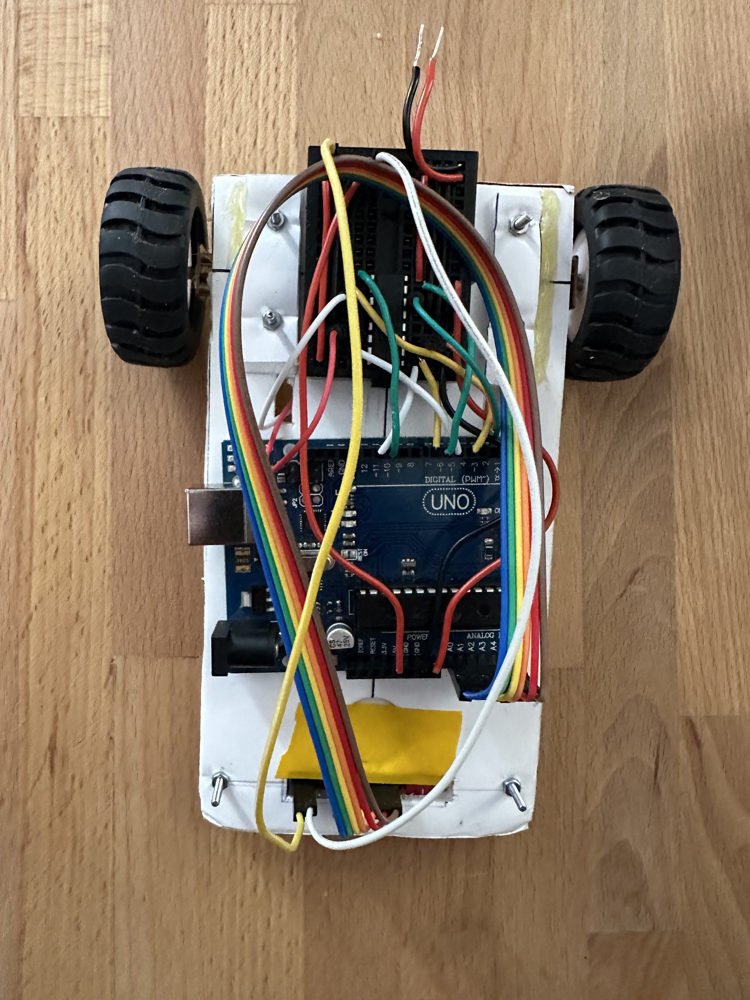

# Turbo Fabi - Line Follower

  
[Watch the full video here!](https://youtu.be/HdzTXu5iEFA)

## Project Overview 🤖

Welcome to Turbo Fabi, a line follower project that utilizes PID control. Turbo Fabi is a robot designed to autonomously track and follow a predefined path marked by a visible line on the ground. This project is implemented using the Arduino Uno and motor drivers, with infrared (IR) sensors for line detection.

## Components 🛠️

Here's a list of components used in Turbo Fabi's construction:

- **Chassis**: Foamboard structure for a lightweight and customizable build.
  
- **Arduino Uno**: The brain of Turbo Fabi, controlling its movements and interactions with sensors.
  
- **Mini Breadboard**: For easy prototyping and connecting electronic components.
  
- **L293D Driver**: Controls the small DC motors.
  
- **Wheels**: Two wheels for movement along the track.
  
- **DC Motors with Gearbox**: Two motors for precise control and movement.
  
- **Ball Caster**: Ensures stability and smooth navigation at the robot's front.
  
- **IR Sensor (QTR-8A)**: Used for line detection.
  
- **LiPo Battery (Kryptonium 2S1P 12V)**: Compact lithium-polymer battery supplying energy.
  
- **Wires**: Various wires for component connections, ensuring proper communication and power distribution.

These carefully chosen components work together to create a well-balanced and efficient line-following robot.

## Usage 🎮

1. Set up Turbo Fabi on a track with a visible line.
2. Power on Turbo Fabi.
3. Let Turbo Fabi calibrate its sensors.
4. Watch as Turbo Fabi autonomously follows the line.

## Contributing 🤝

Contributions from the following individuals have made Turbo Fabi possible:

- [0xfabian](https://github.com/0xfabian)
- [alexalex200](https://github.com/alexalex200)
- [dragos1113](https://github.com/dragos1113)

## Best Time Achievement 🏆

Turbo Fabi completed the circuit with an impressive best time of **13.551 seconds**.
 
## Media 📸

